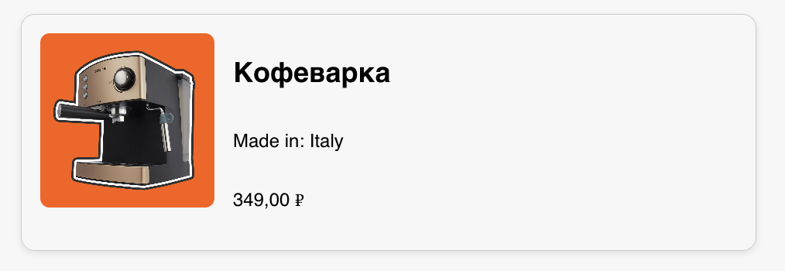

ProductCard — карточка товара.

Простой и адаптивный React-компонент на TypeScript для отображения карточки товара.

Описание задания:
Разработать компонент `ProductCard`, который принимает через `props` следующие данные:

- Название товара (`title`)
- Страна происхождения (`origin`)
- Цена в копейках (`price`) и валюта (`currency`) — поддержка `RUB`, `USD`, `EUR`
- Изображение товара (`imageUrl`)

Реализация:

- Использован React + TypeScript
- Цена форматируется с помощью `Intl.NumberFormat`
- Адаптивная вёрстка — при ширине окна менее 500px компонент перестраивается в одну колонку (вертикально)
- Стили написаны с использованием CSS-модулей

Технологии:

- React 18
- TypeScript
- CSS Modules
- Create React App (CRA)

Запуск проекта:

- git clone https://github.com/maximfill/product-test.git
- cd product-test
- npm install
- npm start
